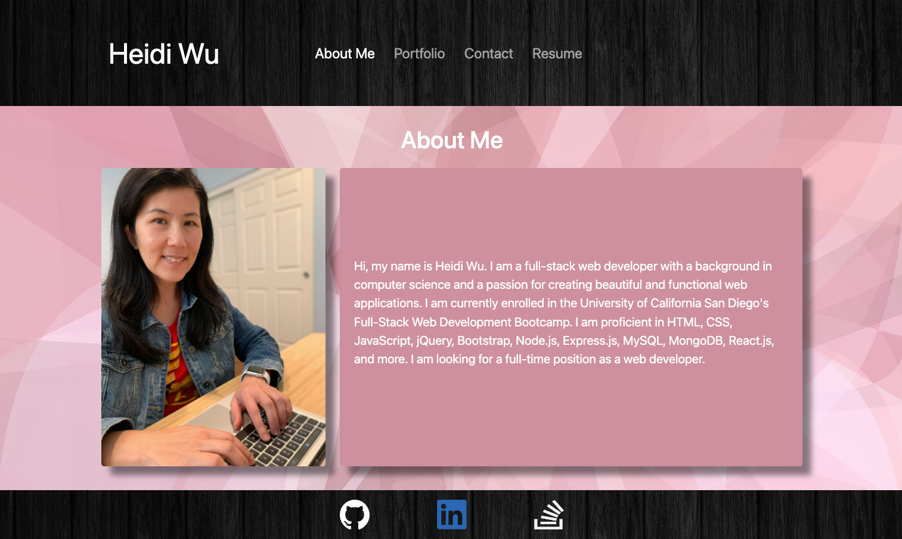
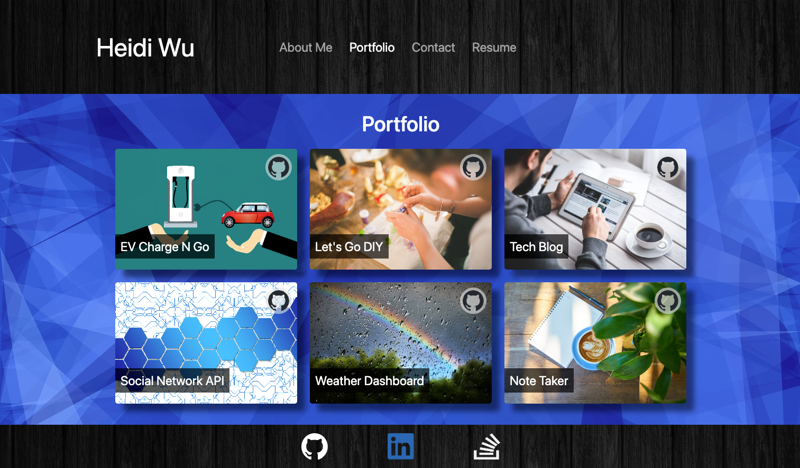
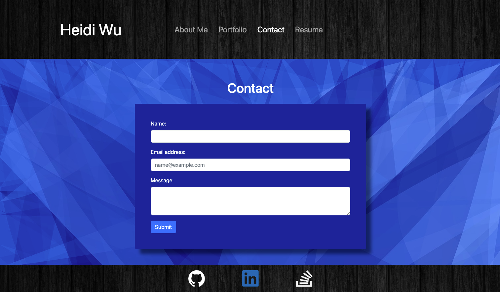
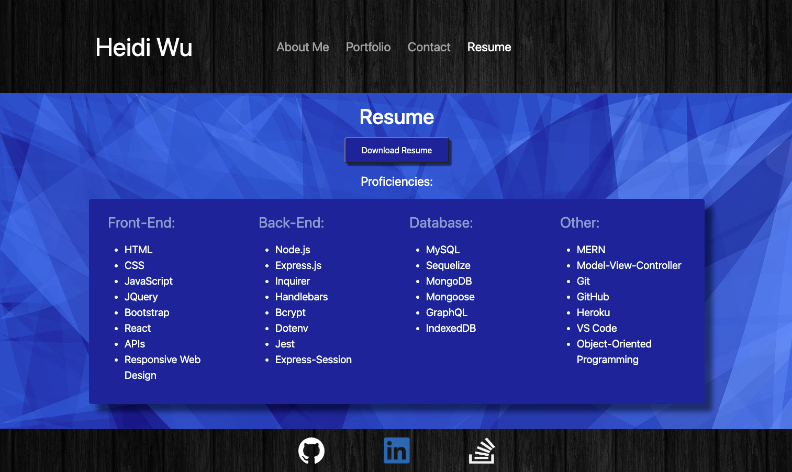

# React-Portfolio

## Description
This is my portfolio built with React to let you know about me, to share my projects, my contact and my resume.

## Table of Contents
* [Deployed Application](#deployed-application)
* [Usage](#usage)
* [Built With](#built-with)
* [Screenshot](#screenshot)
* [License](#license) 

## Deployed Application

Please go to [https://heidiwu3388.github.io/React-Portfolio/](https://heidiwu3388.github.io/React-Portfolio/) to see my deployed portfolio.

## Usage
- When you visit the website, you will see the **About Me** page with my recent photo and a short bio about myself.
- You can select any item from the navigation bar at the top of the page.
- When you select **Portfolio** from the navigation bar, you will see six titled images of my projects.
- Inside each image, the project title links to the deployed application, and the Github icon links to the corresponding GitHub repository.
- When you select **Contact** form the navigation bar, you will see a contact form with fields for a name, an email address, and a message.
- When you select **Resume** from the navigation bar, you will see a button for downloading my resume in pdf format, and a list of my proficiencies.
- In the footer, there are icons with links to my GitHub, LinkedIn and Stack Overflow profiles. 

## Built With

- *React*
- *Bootstrap*
- *JavaScript*
- *JSX*
- Deployed with *GitHub pages*
    

## Screenshot

About Me:

Portfolio:

Contact:

Resume:

## License

 

This project is licensed under the terms of the MIT license.